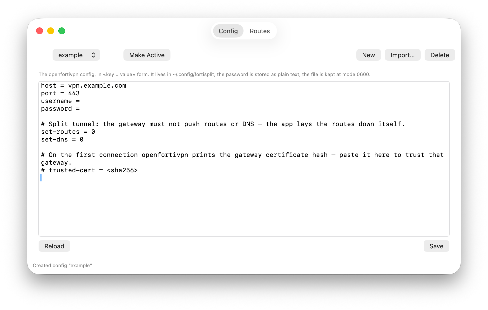

# FortiSplit

[English](README.md) · **Русский**

Меню-бар клиент FortiGate SSL-VPN для macOS с настоящим сплит-туннелем: в
туннель уходят только подсети из твоего списка, весь остальной трафик идёт
обычным путём.



## Как устроено

FortiSplit запускает [openfortivpn](https://github.com/adrienverge/openfortivpn) с
`set-routes = 0`, так что шлюз не трогает таблицу маршрутов. Когда туннель
поднялся, приложение само кладёт подсети на интерфейс `pppN` — и умеет применить
изменённый список к работающему туннелю, ничего не переподключая.

Конфиги — обычные файлы в `~/.config/fortisplit`: правятся из приложения или
любым редактором, root для этого не нужен. Их может быть сколько угодно,
активный переключается в окне настроек, у каждого свой список подсетей.

Вне бандла появляются ровно два постоянных файла:

| Путь | Зачем |
|---|---|
| `/usr/local/bin/fortisplit-vpnctl` | root-скрипт: единственное место, где что-то делается от root |
| `/etc/sudoers.d/fortisplit` | правило, разрешающее запускать без пароля **только** его |

Это вся привилегированная поверхность. Сам GUI root не имеет: он просит скрипт
запустить openfortivpn, отдать статус и проложить маршруты.

## Установка

Нужен macOS 13 или новее и openfortivpn:

```bash
brew install openfortivpn
```

Скачай архив из [релизов](../../releases), распакуй и выполни:

```bash
xattr -dr com.apple.quarantine FortiSplit.app   # подпись ad-hoc, после скачивания Gatekeeper не пустит
cp -R FortiSplit.app /Applications/
./install.sh                                    # один раз спросит пароль sudo
open /Applications/FortiSplit.app
```

Либо собери сам: `./build-app.sh && ./install.sh`.

В строке меню появится щит — залитый, пока туннель поднят, контурный, когда
выключен. Открой **Настройки…**, заполни шаблон конфига или нажми **Импорт…** и
подсунь готовый конфиг openfortivpn, а подсети впиши на вкладке **Маршруты**.

При первом подключении openfortivpn обычно ругается на сертификат шлюза и печатает
его хэш (виден через **Показать логи**) — добавь в конфиг `trusted-cert = <хэш>`.

## Что стоит понимать

Правило NOPASSWD означает, что любой процесс от твоего имени может дёрнуть скрипт
и через конфиг openfortivpn, который тот скармливает root, получить root. Для
личной машины это нормальный размен, для рабочей решай сам. Строгая альтернатива —
`SMAppService` + XPC — требует платного Developer ID, от которого проект
сознательно отказался.

Если на VPN включён одноразовый код, фоновый запуск работать не будет: подключайся
вручную через `openfortivpn -o <otp>`, а приложение используй для статуса и
маршрутов.

## Подробнее

- [INSTALL.md](INSTALL.md) — что делают `install.sh` и root-скрипт, как удалить
- [docs/architecture.ru.md](docs/architecture.ru.md) — архитектура, замечания по безопасности, скрипты сборки и иконок
- [AGENT.md](AGENT.md) — заметки для того, кто продолжит
