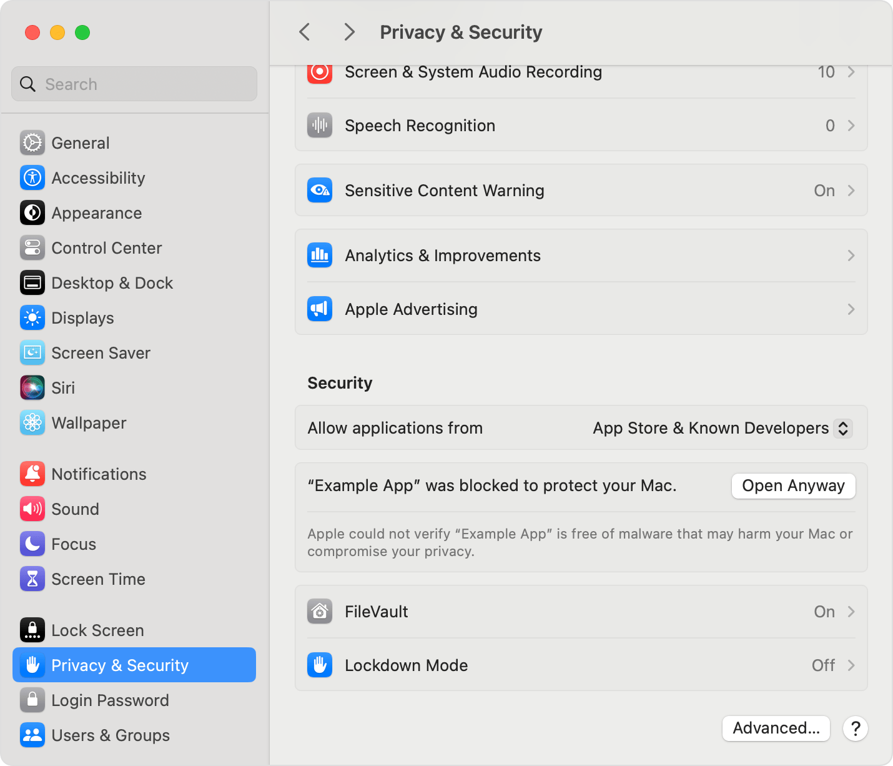

# FortiSplit

[English](README.md) · **Русский**

Меню-бар клиент FortiGate SSL-VPN для macOS с настоящим сплит-туннелем: в
туннель уходят только подсети из твоего списка, весь остальной трафик идёт
обычным путём.


## Как устроено

FortiSplit запускает [openfortivpn](https://github.com/adrienverge/openfortivpn) с
`set-routes = 0`, так что шлюз не трогает таблицу маршрутов. Когда туннель
поднялся, приложение само кладёт подсети на интерфейс `pppN` — и умеет применить
изменённый список к работающему туннелю, ничего не переподключая.

Конфиги — обычные файлы в `~/.config/fortisplit`: правятся из приложения или
любым редактором, root для этого не нужен. Их может быть сколько угодно,
активный переключается в окне настроек, у каждого свой список подсетей.

Вне бандла появляются ровно два постоянных файла:

| Путь | Зачем |
|---|---|
| `/usr/local/bin/fortisplit-vpnctl` | root-скрипт: единственное место, где что-то делается от root |
| `/etc/sudoers.d/fortisplit` | правило, разрешающее запускать без пароля **только** его |

Это вся привилегированная поверхность. Сам GUI root не имеет: он просит скрипт
запустить openfortivpn, отдать статус и проложить маршруты.

## Установка

Нужен macOS 13 или новее. Сначала поставь openfortivpn — FortiSplit им управляет,
внутрь он не вшит:

```bash
brew install openfortivpn
```

Затем скачай **FortiSplit-x.y.z.pkg** из [релизов](../../releases) и открой его.
Установщик положит приложение в `/Applications`, root-скрипт в `/usr/local/bin` и
добавит правило sudoers для твоего пользователя. Больше ничего.

### Как разрешить запуск

Пакет подписан ad-hoc, а не платным Developer ID, поэтому с первого раза macOS
его не откроет. Это ожидаемо и делается один раз:



1. Дважды кликни по `.pkg` — появится предупреждение, закрой его.
2. Открой **Системные настройки → Конфиденциальность и безопасность** и
   пролистай вниз до раздела **Безопасность**.
3. Рядом с сообщением о заблокированном файле нажми **Открыть всё равно** (на
   скриншоте имя приложения условное) и подтверди через Touch ID или пароль.
4. Кликни по `.pkg` ещё раз — теперь он установится.

Если привычнее терминал, этот путь обходит диалог совсем:

```bash
sudo installer -pkg FortiSplit-0.1.0.pkg -target /
```

Добавь `-allowUntrusted`, если он пожалуется на отсутствие подписи.

Собрать из исходников: `./build-app.sh && ./install.sh`.

### Первый запуск

Запусти FortiSplit из `/Applications` — в строке меню появится щит, залитый, пока
туннель поднят, и контурный, когда выключен. Открой **Настройки…**, нажми
**Новый** для шаблона конфига или **Импорт…**, чтобы подсунуть готовый конфиг
openfortivpn, а подсети впиши на вкладке **Маршруты**.

При первом подключении openfortivpn обычно ругается на сертификат шлюза и печатает
его хэш (виден через **Показать логи**) — добавь в конфиг `trusted-cert = <хэш>`.

### Удаление

```bash
sudo rm -f /usr/local/bin/fortisplit-vpnctl /etc/sudoers.d/fortisplit /var/log/fortisplit.log
sudo pkgutil --forget local.fortisplit.installer
rm -rf /Applications/FortiSplit.app
rm -rf ~/.config/fortisplit      # конфиги с паролями — удаляй осознанно
```

## Что стоит понимать

Правило NOPASSWD означает, что любой процесс от твоего имени может дёрнуть скрипт
и через конфиг openfortivpn, который тот скармливает root, получить root. Для
личной машины это нормальный размен, для рабочей решай сам. Строгая альтернатива —
`SMAppService` + XPC — требует платного Developer ID, от которого проект
сознательно отказался.

Если на VPN включён одноразовый код, фоновый запуск работать не будет: подключайся
вручную через `openfortivpn -o <otp>`, а приложение используй для статуса и
маршрутов.

## Подробнее

- [docs/architecture.ru.md](docs/architecture.ru.md) — архитектура, что делает root-скрипт, замечания по безопасности, скрипты сборки и иконок
- [AGENT.md](AGENT.md) — заметки для того, кто продолжит
